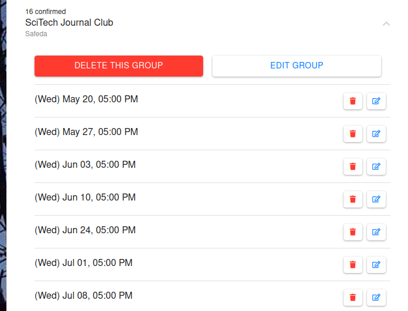

# Login 

Use your NCBS, InStem, or CCAMP login id and associated password. Hippo accepts
both `intranet` and `webmail` accounts. If you are using `webmail` credentials,
the login will be slower. We recommend that you use your
[intranet](http://intranet.ncbs.res.in/user){target=blank} credentials.

!!! info "First time login"

    <iframe width="560" height="315" src="https://www.youtube.com/embed/6iyZKCvX2lU" frameborder="0" allow="accelerometer; autoplay; encrypted-media; gyroscope; picture-in-picture" allowfullscreen></iframe>

    Kindly review/edit your details. If you are suppose to give Annual
    Work Seminar (==AWS==), you must double check all entries. In case of
    discrepency, write to [Academic Office](mailto:acadoffice@ncbs.res.in).

# FAQ 

##  How to create a general booking request?

<iframe width="560" height="315" src="https://www.youtube.com/embed/8e3TCXek9qE" frameborder="0" allow="accelerometer; autoplay; encrypted-media; gyroscope; picture-in-picture" allowfullscreen></iframe>

Make sure you file your booking under the right `CLASS` (e.g. `THESIS SEMINAR`,
`LAB MEETING`, `TALK` etc.).  Once a request is submitted, your slot/venue is
blocked and an email is sent your way. 

You can update your booking by visiting ==:fa-bars: -> My Bookings==.

!!! note "Recurrent Event"
    To make recurrent booking (maximum for 6 months), select appropriate
    days in __select days__ list. To limit your booking to some weeks such
    as first and third of every month, select those weeks (==Hold down
    `Ctrl` keys when selecting multiple entries.==).

    Don't worry, you can always delete your booking requests in case of
    error.

!!! info "Emails in spam"
    If you are importing work emails into other email accounts such as
    gmail, please check your spam folder.

You will receive confirmation/rejection email after approval/disapproval.
You will receive an email alert to renew your booking, 5 to 7 days in
advance before your last event expires.

## I need to change a confirmed booking (of a public Talks/Seminar)?

If the talk is already confirmed, then you need to contact academic admin or
deans office to cancel it. If not, then you need to cancel pending request.

## How do I upload my AWS abstract?

Click on ==__My AWS__== link in your top left :fa-bars: menu. If you cant’t
find this link that means you are not eligible for the AWS. Please contact
academic office.

## How do I book my thesis seminar?

<iframe width="560" height="315" src="https://www.youtube.com/embed/6qUtg3mj9sg" frameborder="0" allow="accelerometer; autoplay; encrypted-media; gyroscope; picture-in-picture" allowfullscreen></iframe>

# How to book a public talk, lecture or seminar?

==:fa-plus: Booking --> Select the `TYPE` of event --> Add Speaker --> Talks
details --> Save talk --> Book talk==

Same as the above. Select the appropriate class and have the speaker details
handy. We strongly recommend that you arrange photo and email id of speaker.
Email of the speaker is never publicly displayed. 

After approval, you can see your event
[here](https://ncbs.res.in/hippo/v1/info/talks) and on google calendar after
5pm or 9am.

The emails will be sent to appropriate mailing lists at appropriate times.
Morning 8am is the usual time when automatic email is sent.

## Updating/scheduling and deleting talks and bookings?

Go to ==:fa-bars: (top left) --> My Bookings==. You will find all your bookings
including upcoming talks and other bookings both confirmed and pending
approval. Click a list item, to edit/update and even delete it.  

For the recurrent booking, you can chose to delete one or whole group
together. You can also update all entries together. There is no provision of
changing the description of only one entry.

{width=300}
